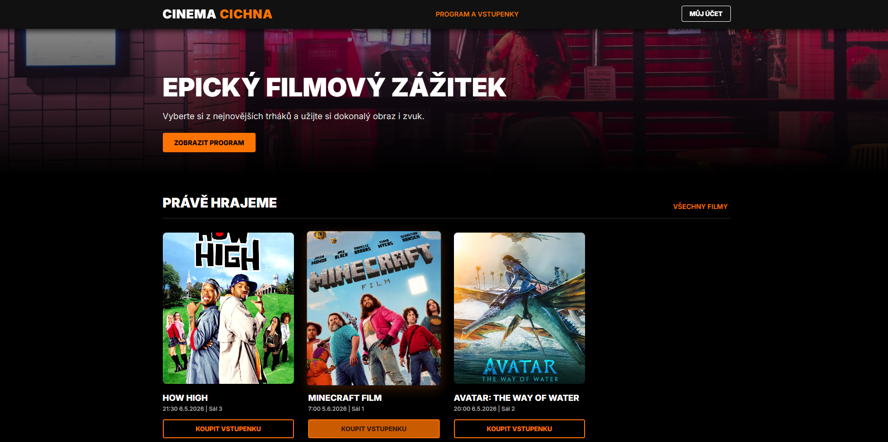
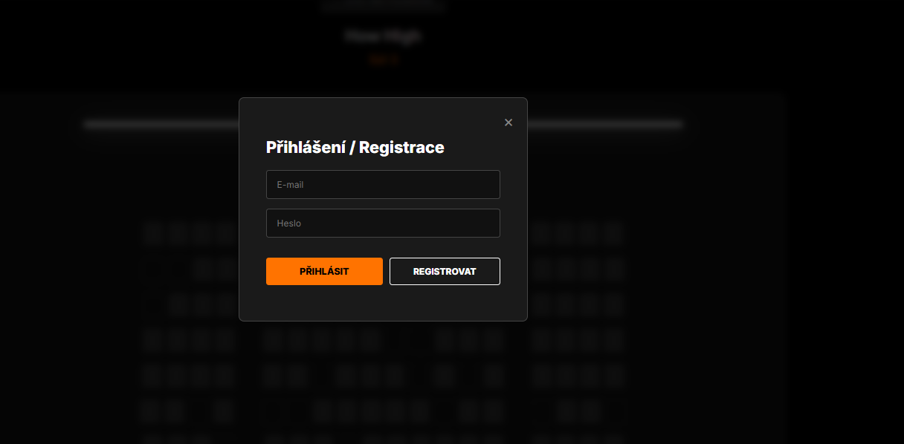
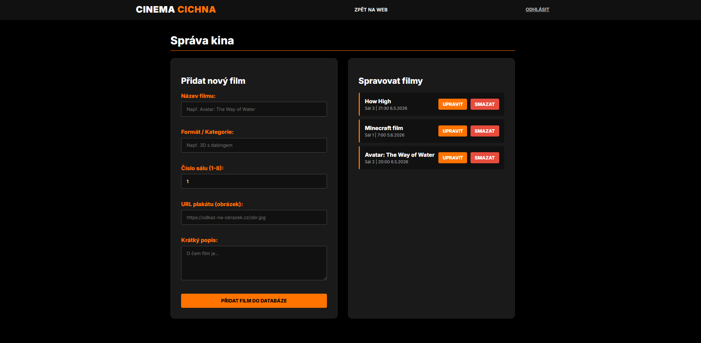
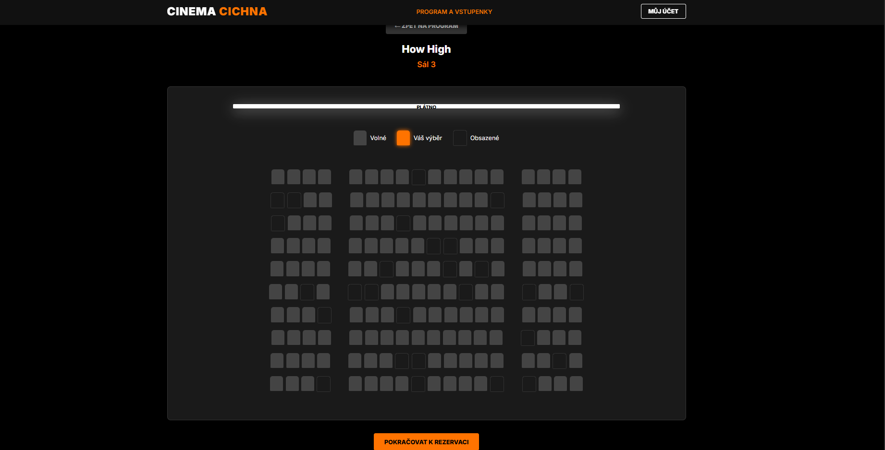
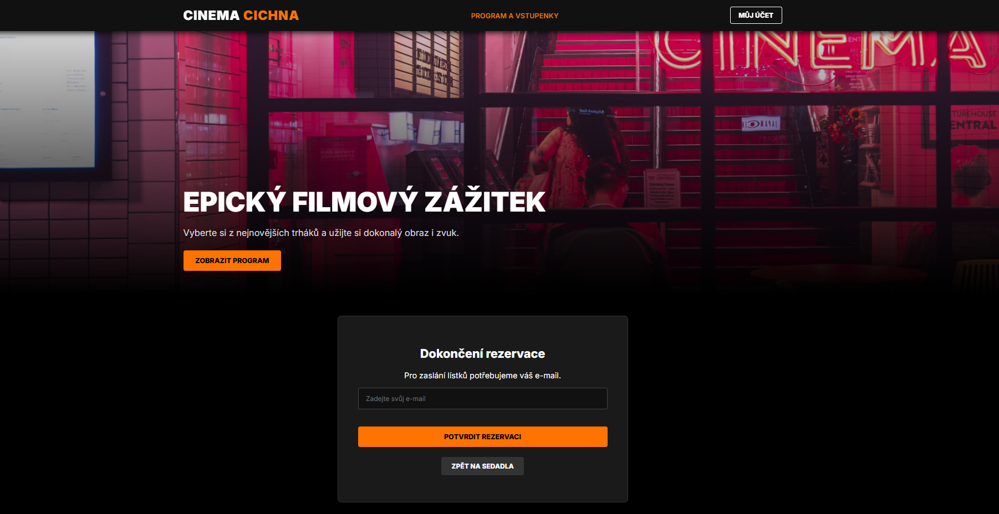
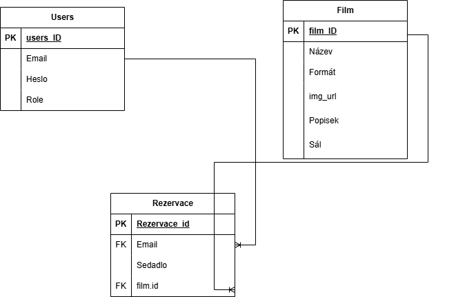

# Cinema Cichna

*Webová aplikace pro rezervaci vstupenek do kina a správu filmového programu.*

Cinema Cichna je školní projekt. Cílem projektu bylo vytvořit plnohodnotnou webovou aplikaci propojenou s databází, která uživatelům umožňuje prohlížet aktuální program, interaktivně vybírat sedadla a rezervovat vstupenky, zatímco administrátorům poskytuje rozhraní pro správu filmů.

## Zadání

1. **Téma:** Rezervační systém pro kino (Cinema Cichna).
2. **Typ projektu:** Webová aplikace napojená na databázi MySQL (správa uživatelů, filmů a rezervací).
3. **Specifikace:** Registrace a autentizace uživatelů, interaktivní výběr sedadel v sále, nákup/rezervace lístků na zadaný e-mail a zabezpečená administrace programu.

## Spuštění stránky
* Pro podívání se/vyzkoušní stránky odkaz zde : https://cinemacichna.xo.je/

## Hlavní funkce

### Uživatelské a administrátorské funkce

* **Autentizace uživatelů:** Kompletní přihlašovací a registrační systém přes modální okno.
* **Prohlížení programu:** Dynamické načítání aktuálně hraných filmů z databáze včetně informací o sálu a formátu.
* **Rezervace sedadel:** Interaktivní mapa kinosálu umožňující výběr konkrétních míst. Systém rozlišuje volná, vybraná a obsazená sedadla.
* **Administrátorský panel:** Vyhrazená sekce (pouze pro uživatele s rolí `admin`) umožňující přidávat, upravovat a bezpečně mazat filmy z databáze.

### Ukládání dat
* **MySQL Databáze:** Úložiště pro data uživatelů (e-mail, heslo, role), katalog filmů (název, popis, obrázek, sál) a tabulku samotných rezervací.
* **Zabezpečení:** Uživatelská hesla jsou bezpečně **hashována** před uložením do databáze pomocí vestavěné PHP funkce `password_hash()`. Ochrana administrátorské sekce před neoprávněným přístupem.

## Použité technologie

- **PHP**: Použito pro tvorbu backendového API a komunikaci s databází.
- **JavaScript**: Obstarává frontendovou logiku, asynchronní načítání (`fetch`), generování sedadel a správu relací (`localStorage`).
- **SQL**: Zajišťuje strukturu databáze a dotazy.
- **HTML & CSS**: Struktura a vizuální design uživatelského rozhraní aplikace (využití CSS proměnných a flexboxu/gridu).

## Struktura projektu

```bash
CinemaCichna/
├─ index.html               # Úvodní stránka s výpisem filmů a krokovou rezervací
├─ admin.html               # Zabezpečený administrátorský panel pro správu filmů
├─ index.JS                 # Hlavní logika klienta (komunikace s API, interakce)
├─ stylovka.css             # Globální kaskádové styly pro aplikaci
├─ rezervace (1).php        # Backendové API pro obsluhu DB a uživatelských požadavků
└─ README.md                # Tento soubor

```
## Závěr
Tvorba projektu Cinema Cichna pro mě byla skvělou příležitostí, jak si v praxi vyzkoušet provázání frontendu s backendem a databází. Během vývoje jsem se naučil řešit konkrétní problémy, jako je například generování dynamické mapy kinosálu nebo správa uživatelských relací prostřednictvím kombinace PHP a JavaScriptu. Pro urychlení práce a pochopení některých složitějších konceptů (například optimalizace asynchronních dotazů nebo hashování hesel) jsem využíval nástroje umělé inteligence. AI mi posloužila jako dobrý rádce při zásecích, nicméně celkový vizuál, struktura kódu a klíčová logika systému jsou výsledkem mé vlastní práce. Práce na tomto rezervačním systému mi ukázala, jak tyto aplikace fungují v reálném světě, a výrazně mě posunula v programátorských dovednostech.

## Náhled stránky

### Úvodní stránka


### Registrace


### Správa kina


### Výběr sedadel


### Dokončení rezervace


## Diagramy
